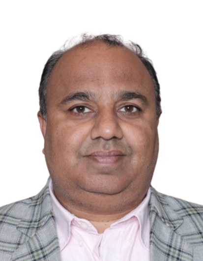

# Department of Electronics and Communication  Engineering

## Message from HoD's Desk  

The Department of Electronics and Communication Engineering, established in 1981, is one of the most dynamic departments of Guru Nanak Dev Engineering College. It was the first major diversification initiative by the college, 25 years after its establishment. The department is currently running Bachelors and Masters of Technology courses in Electronics and Communication Engineering and has around 10 scholars enrolled for doctorate in areas like Antenna Design, VLSI, Optical communication etc. Ever since its inception, the department has been the hub of academic excellence through some great teachers who have laid a sound foundation as well as the cream of students of the region, who have spread their wings all over the globe. The alumni of the department are not only excelling in India but also in the Silicon Valley and other hubs of Electronics Technology. They are at the forefront of the Telecom revolution of the last 20 years and manning pivotal positions in Telecom operators in India, South East Asia, Pacific region and Africa. In the end, I can say that we incorporate good technical skills and knowledge to each individual associated with us.

Dr. Munish Rattan   
(Head of Department)

## Department at Glimpse

### The Department's Entrance

-----------------------------------------

### The Departmental Library

-----------------------------------------

### ECE faculties at Semicon Roadshow on 27 Feb, 2023

-----------------------------------------

### Two Days workshop on 3D Printing (The Future Generation Technology) from 2, May 2023 to 3, May 2023

------------------------------------------

###  Industrial Visit to BSNL Ludhiana in relation with Four week Training course on Digital Designing and Secured Wireless Communication from 10, July 2023 to 4, Aug 2023

------------------------------------------

###  Four week Training course on Project Design using Microcontroller Consultancy from 10, July 2023 to 4, Aug 2023

---------------------------------------

### Teachers Day Celebration at ECE Department on 5, Sept 2023

-----------------------------------------

### E-Vision 2023 organized by IETE Student Forum on 06, Oct 2023

-----------------------------------------

### Two weeks value added workshop on "Hands-on Training Program on Development in Communication Engineering and Electronics" under IETE Student Forum from 19, Feb 2024 to 1, Mar 2024

-----------------------------------------

### Four Week Training on Project Design using Microcontroller Consultancy from 5, June 2024 to 5, July 2024

-----------------------------------------

### Four Week Training on Robotics with ML from 11, June 2024 to 11, July 2024

-----------------------------------------

### Four Week Training on Advanced Simulation Techniques for PLC Automation & IoT in Embedded System from 5, June 2024 to 5, July 2024 

-----------------------------------------

### Online Talk with IIT Madras on Optical Communication, 2024

-----------------------------------------

## Faculty Achievements  

- **Preeti Pannu** reveiewer for 2 manuscripts in Transactions on Emerging Telecommunications Technologies in 2024.
  
- **Preeti Pannu** give their contribution in reviewing 2 manuscript in 2024 for Scientific Reports.

- **Preeti Pannu** give their contribution in reviewing 2 manuscript in 2025 for Scientific Reports.
 
- **Preeti Pannu** Reviewer at the 4th International Conference on Advanced Network Technologies and Intelligent Computing (ANTIC-2024) organized by the Department of Computer Science, Institute of Science, Banaras Hindu University (BHU), Varanasi, India, held in hybrid mode during December 19–21, 2024.

- **Gurpurneet Kaur** Reviewer of Manuscripts for International Conference on Digital Innovation in Electronics, Communication and AI (DIECAI-2025)

## Publications  (Journals)

[1] Pankaj Palta and **Munish Rattan**, “Effects of Different Substrates for Wearable Patch Antennas at 2.45 GHz,” *Innovations in Computing*, Jan. 2025.

[2] **Navneet Kaur**, Chahat Jain, and Munish Rattan, “Optimized Design of Dual-K Spacer FinFET Using Bio-Inspired Artificial Hummingbird Algorithm at 10 nm Gate Length,” *National Academy Science Letters (Springer India)*, Jan. 2025.

[3] Ram Devi, **Gurpurneet Kaur**, Ameeta Seehra, Munish Rattan, Geetika Aggarwal, and Michael Short, “Low-Power Energy-Efficient Hetero-Dielectric Gate-All-Around MOSFETs: Enablers for Sustainable Smart City Technology,” *Energies*, Mar. 2025.

[4] Ramneet Kaur Sahota, **Preeti Pannu**, **Gurjot Kaur Walia**, **Shivmanmeet Singh**, “Investigation of MDM-WDM ISOWC System Using Hybrid Laguerre Gaussian (LG)-Hermite Gaussian (HG) Intensity Profiles,” *Journal of Optics*, May 2025.

[5] **Daljit Singh**, “Harnessing Immune Mechanisms for Cyber Security – An Intrusion Detection Approach,” *International Journal of Scientific Development and Research*, May 2025.

[6] **Gurpurneet Kaur** *et al*., “Allocation of Stocks in the Portfolio Using Puma Optimizer,” *International Journal of Creative Research Thoughts*, May 2025.

[7] **Harminder Kaur**, **Baljeet Kaur**, and Manjit Singh Bhamrah, “Flat Top Optical Multicarrier Generation for Ultra Dense Asymmetrical Radio over Fiber System,” *Optoelectronics and Advanced Materials – Rapid Communications*, June 2024.

[8] Harmandeep Kaur, **Harleen Kaur**, **Gurleen Kaur**, **Shivmanmeet Singh**, “Inclusion of Digital Electronics in Computer Applications: Architectures, Advancements, and Integration,” *International Journal of Research and Analytical Reviews (IJRAR)*, June 2025.

[9] **Gurleen Kaur**, “A Comprehensive Review of Deep Learning Techniques and Its Applications,” *International Journal of Creative Research Thoughts (IJCRT)*, June 2025.

[10] **Gurleen Kaur**, “Computer Applications in Electronics: Integration, Advancements, and Future Prospects,” *International Journal of Research and Analytical Reviews (IJRAR)*, June 2025.

[11] **Gurleen Kaur**, “Blockchain for Internet of Things: A Survey,” *International Journal of Research and Analytical Reviews (IJRAR)*, June 2025.

[12] **Gurleen Kaur**, “E-Waste Management System in Smart Cities,” *International Journal of Research and Analytical Reviews (IJRAR)*, June 2025.

[13] **Gurleen Kaur**, “Smart Transport System,” *International Journal of Creative Research Thoughts (IJCRT)*, June 2025.

[14] **Gurleen Kaur**, “Data Security and Privacy,” *International Journal of Creative Research Thoughts (IJCRT)*, June 2025.

[15] **Gurleen Kaur**, “Impact of AI on Business and Societies in Smart Cities,” *International Journal of Creative Research Thoughts (IJCRT)*, June 2025.

[16] **Narwant Singh Grewal**, Jaspreet Kaur, and **Navneet Kaur**, “A Symmetrical 32 × 1 and 16 × 1 Elements Antenna Array Failure Correction with Nulls Using Brain Storm Optimization,” *Wireless Personal Communications (Springer)*, July 2024.

[17] Karthickmanoj, T. Sasilatha, D. Lakshmi, Vishal Goyal, Talal Taha Ali, Ajay Nautiyal, Kamal Kant Sharma, Raman Kumar, and **Shivmanmeet Singh**, “Revolutionizing Agricultural Productivity with Automated Early Leaf Disease Detection System for Smart Agriculture Applications Using IoT Platform,” *Environment, Development and Sustainability*, July 2024.

[18] **Daljit Singh**, “Immune Inspired Cyber Defence – An Intrusion Detection Scheme,” *Journal of Emerging Technologies and Innovative Research*, July 2025.

[19] Puran Singh, **Munish Rattan**, **Narwant Singh Grewal**, and Geetika Aggarwal, “Distributed Feature Matching for Robust Object Localization in Robotic Manipulation,” *IEEE Access*, Oct. 2024.

[20] Rajan Vohra, **Kunwar Partap Singh**, Jupinder Kaur, Vishal Jagota, and Jyoti Bhola, “Electronic Properties of ZnO Nanowires: A First-Principles Analysis Using Two-Probe Methodology,” *International Journal of Nanoelectronics and Materials (IJNeaM)*, Oct. 2024.

[21] **Shivmanmeet Singh**, Harmandeep Kaur, and **Preeti Pannu**, “Performance Analysis of QAM and QPSK for FSOWC System Using Machine Learning,” *Journal of Optics*, Oct. 2024.

## Publications  (Conferences)

[1] **Kunwar Partap Singh**, Rajan Vohra, “Comparative Analysis of Electrical Conductance through Guanine and Thymine Based Molecular Devices,” *6th International Conference on Intelligent Circuits and Systems (ICICS-2024)*, Lovely Professional University, Phagwara, 25–26 October 2024, International.

[2] **Narwant Singh Grewal, Preeti Pannu**, “Frequency Reconfigurable Antenna Design Using PSO,” *International Conference on Next-Generation Communication and Computing (NGCCOM-2024)*, ABES Engineering College, Ghaziabad, 5–6 December 2024, International.

[3] **Preeti Pannu, Narwant Singh Grewal, Gurpurneet Kaur**, “Design of Dually Notched Compact 4-Port UWB MIMO Antenna,” *8th International Conference on Micro-Electronics and Telecommunication Engineering*, SRM Institute of Science & Technology, Ghaziabad, 6 December 2024, International.

[4] **Preeti Pannu, Manpreet Kaur, Narwant Singh Grewal**, “Frequency Reconfigurable Antenna Design Using PSO,” *International Conference on Next-Generation Communication and Computing (NGCCOM-2024)*, ABES College, Ghaziabad, 5 December 2024, International.

[5] Arnav Gautam, **Harleen Kaur**, Piyush, “Real Time Weed Detection Using YOLOv8: A Lightweight Vision System for Smart Farming,” *6th International Conference on Data Science and Applications*, Jaipur, 16–18 July 2024, International.

[6] Amandeep Kaur Kang, Shubham Sharma, **Gurjot Kaur Walia**, Manisha, “Application of Artificial Intelligence in Strategic Restaurant Marketing: A Review,” *ISTE National Annual Convention and Yuva Kaushal Utsav 2025*, Lamrin Tech Skill University, Punjab, 13–14 February 2025, International.

[7] Chanpreet Kaur, **Harminder Kaur D/o Avtar Singh**, “Green Computing – A Review,” *International Conference on Sustainable Developments in Computational Optimization and Intelligent Systems (ICSDCOIS-2025)*, Bhai Gurdas Institute of Engineering & Technology, Sangrur, 24–25 April 2025, International.

[8] **Gurjot Kaur Walia, Navneet Kaur, Chahat Jain**, “Bridging Tradition and Technology: Integrating Indian Knowledge Systems with Artificial Intelligence,” *International Conference on Indian Knowledge System: From Glorious Past to Bright Future*, Maharaja Agrasen University, Baddi, in collaboration with I.K. Gujral Punjab Technical University and Baba Mastnath University, 4–5 April 2025, International.

[9] Ramneet Kaur, **Preeti Pannu, Gurjot Kaur**, “Performance Analysis of Radio over FSO for Advanced Modulation Formats,” *6th International Conference on Recent Innovations in Science & Technology*, Holy Grace Academy of Engineering, Mala, Thrissar, Kerala, 27 April 2025, International.

[10] **Gurpurneet Kaur**, Ram Devi, **Munish Rattan, Narwant Singh, Preeti Pannu**, G. Aggarwal, G.P.K. Sohi, “Tunable HfxTi1-xO2 Dielectrics for Low-Power and High-Performance GAA Nanowire MO,” *Nanoelectronics and VLSI Design*, NIT Jalandhar, 5–7 June 2025, International.

[11] **Gurleen Kaur, Gurpurneet Kaur, Baljeet Kaur**, “Emerging Techniques in Underwater Communication: A Comprehensive Review,” *International Conference on Electronics, AI and Computing (EAIC-2025)*, NIT Jalandhar, 5–7 June 2025, International.

[12] **Gurjot Kaur Walia, Navneet Kaur, Chahat Jain**, “Bridging Tradition and Technology: Integrating Indian Knowledge,” *International Conference on Indian Knowledge System: From Glorious Past to Bright Future*, Maharaja Agrasen University, I.K. Gujral Punjab Technical University and Baba Mastnath University, 4–5 April 2025, International.

## Events Organized (FDPs/Conferences/STCs/SDTs/Workshops/Webinars etc.)  

| Sr. No. | Name of Event                                                  | Faculty Coordinator           | Duration | Date(s)               | Sponsor(s) |
|:--------|:---------------------------------------------------------------|:------------------------------|:---------|:----------------------|:-----------|
| 1     | Expert Talk on PLC by Satnam Singh                             | **Dr. Shivmanmeet Singh** | 1 day    | 14-08-2024      | IETE GNDEC                      |
| 2     | Core team Meeting                                              | **Dr. Shivmanmeet Singh** | 1 day    | 20-08-2024      | IETE GNDEC                      |
| 3     | Workshop on cyber security                                     | **Dr. Shivmanmeet Singh** | 1 day    | 03-09-2024      | IETE GNDEC                      |
| 4     | Hands on experience                                            | **Dr. Shivmanmeet Singh** | 1 day    | 11-10-2024      | IETE GNDEC                      |
| 5     | digital Artistry                                              | **Dr. Shivmanmeet Singh** | 1 day    | 14-10-2024      | IETE GNDEC                      |
| 6     | 2-day Workshop                                                | **Dr. Shivmanmeet Singh** | 2 days   | 28-10-2024      | IETE GNDEC                      |
| 7     | 3D- printing workshop                                         | **Dr. Shivmanmeet Singh** | 1 day    | 13-11-2024      | IETE GNDEC                      |
| 8     | Technova                                                     | **Dr. Shivmanmeet Singh** | 1 day    | 25-11-2024      | IETE GNDEC                      |
| 9     | Electrified Quizzers                                         | **Dr. Shivmanmeet Singh** | 1 day    | 03-02-2025      | IETE GNDEC                      |
| 10    | visit to PEC                                                | **Dr. Shivmanmeet Singh** | 1 day    | 26-03-2025      | IETE GNDEC                      |
| 11    | Mobile chipset repair workshop                              | **Dr. Shivmanmeet Singh** | 1 day    | 11-04-2025      | IETE GNDEC                      |
| 12    | Guess-a-graphy                                             | **Dr. Shivmanmeet Singh** | 1 day    | 23-04-2025      | IETE GNDEC                      |
| 13    | One week short term course on “AI applications in VLSI design” in collaboration with NITTTR, Chandigarh | **Dr. Chahat Jain**       | 5 days   | July 14-18, 2025 | NITTTR Chandigarh and GNDEC     |

## Events Attended (FDPs/Conferences/STCs/SDTs/Workshops/Webinars etc.)  

| Sr. No. | Name of Faculty | Name of Event | Duration | Date(s) | Organizing Institute |
|:--------|:----------------|:--------------|:---------|:--------|:---------------------|

## Expert Lecture delivered

- **Gurpurneet Kaur**, delivered expert lecture on Counter Design using HDL, at SLIET, Longowal, 25/11/2024 – 29/11/2024; delivered expert lecture on FPGA Implementation of Counter Design, at SLIET, Longowal, 25/11/2024 – 29/11/2024; delivered expert lecture on Overview of HDL using Vivado Design Suite, at GNDEC, Ludhiana, 16/12/2024 – 21/12/2024; delivered expert lecture on Enhancing Energy Efficiency in VLSI Circuits through GA and WOA-based Optimization Techniques, at GNDEC, Ludhiana (in collaboration with NITTTR, Chandigarh), 14/07/2025 – 18/07/2025; and delivered expert lecture on Mini Projects using Raspberry Pi, at GNDEC, Ludhiana, 19/02/2025 – 05/03/2025.

## Student's Corner  

#### - Student's Achievements

**Navjot Singh (URN: 2435424)** participated in multiple events including *Reel and Video Making Competition*, *Cut to Campus E-Vision* at GNDEC, *Social Media Campaign* at CGC Mohali, *Tech Reel* at Khalsa College, and *Video Editing Workshop* at GNDEC, securing **1st place in all events**, 26-07-2024.  

**Rishu Jaiswal (URN: 2435436)** participated in *CraftPrix 2.0* at GNDEC Ludhiana and secured **2nd place**, 13-02-2025.  

**Aasa Singh (URN: 2302844)** participated in *Genconian CraftPrix 2.0* at Guru Nanak Dev Engineering College and secured **1st place** in RC Car Competition, 13-02-2025.  

**Krishan Kumar (URN: 2435418)** participated in *Re Brand* at Guru Nanak Dev Engineering College, securing **3rd place**, 06-02-2025.  

**Arnav Bhardwaj (URN: 2302860)** participated in *Guess a Graphy* at GNDEC and secured **2nd place**, 23-04-2025.  

**Harsimran Kaur Bhatti (URN: 2435473)** participated in *Poster Making Competition* on 24-04-2025 and *Tech X Tambola* on 16-09-2025 at GNDEC College, securing **3rd position in Poster Making** and **2nd position in Tech X Tambola**.  

**Gurleen Kaur (URN: 2302872)** participated in *Future Design Hackathon 2025* (National Level) online and secured **1st place**, 02-05-2025.  

**Gurjot Singh (URN: 2203718)** participated in *Inter College Hockey Tournament* at SVIET and secured **2nd place** while playing as a captain, 11-11-2025.  

**Armaan Dugh (URN: 2302859)** participated in *Hacknauts – Code for Change: Campus Edition* at MBA Block, GNDEC, and was declared **winner**, 16-11-2025.  

**Snover (URN: 2435447)** participated in *Idea and Innovation Competition* at Vijaywada, securing **4th place**, 16-11-2025.  

**Snover (URN: 2435447)** participated in *Drone Camp and IIC* at GNDEC and Vijaywada, securing **4th place in both competitions**, 02-01-2026.  

**Krishan Kumar (URN: 2435418)** participated in *MERAKI Hack-the-Throne* Hackathon at IIIT UNA (National Level) – Participation, 07-02-2026.  

**Jagjot Singh (URN: 2104387)** secured *Third Prize* in **CSAW 2024 (BioHack3D)**.  

-----------------------------------------

## IETE STUDENT FORUM

- The events were organized under the guidance of:

-Prof. Shivmanmeet Singh (ISF Secretary)

-----------------------------------------

### Project Exhibition
## Expert Lecture on PLC for Industrial Applications

- 
 The PLC workshop usually begins with an introductory session, where participants are briefed on the importance of PLCs in modern industrial processes on 14 Aug 2024. The session outlines how PLCs are used to automate various industrial operations, ranging from simple machine functions to complex processes involving multiple sensors and actuators. Participants are introduced to the basic architecture of PLCs, includingthe central processing unit (CPU), memory, input/output (I/O) modules, and communication interfaces.

-----------------------------------------
### Workshop on Cyber Security with Shell Scripting Automation 

- 
This event was organized on 3rd September 2024. The expert talk was given by Mr. Ansh Aneja and his team members. Sir and his team shared great knowledge on the given topic. He demonstrated multiple experimentations and projects related to the topic. This lecture was a really resourceful one. The experiments actually give an insightful experience on how things in the industry work.

-----------------------------------------
### Hands on Experience on Soldering and Desoldering

- 
 In alignment with this vision, ISF hosted a knowledge-based event on October 11, 2024, featuring a lecture by Er. Shivmanmeet Singh, a distinguished professor from the Electronics and Communication Engineering Department. The session focused on the fundamentals of soldering and desoldering, providing students with comprehensive insights into these essential electronic assembly techniques. During the event, the professor delivered an in-depth lecture covering the principles, tools, and best practices of soldering and desoldering. Following the theoretical session, students had the opportunity to apply their learning through a hands-on demonstration, further reinforcing their understanding of the concepts. This event served as a valuable platform for students to gain practical exposure and enhance their technical proficiency in electronics manufacturing and repair.

----------------------------------------------
### Digital Artistry

- 
This event was organized on 14th October 2024.In this event, team was created of two members each. Further; they were provided with a slogan. They had to present the slogan in the form of a poster. Also; they also had to present their poster and explain it and the presentation should be very appropriate to the slogan.

----------------------------------------------
### Two Day Workshop : Digital Electronics and VHDL: From theory to Practice

- 
This event was organized on 28th and 29th October 2024. The Workshop Coordinator was Er. KuldeepakSingh . The expert talk was given by Dr. Gurjot Kaur Walia and Er. Kunwar Partap Singh. The topics that were covered were: Combinational Circuit Design and its real life applications, Signal Conversions : Analog and Digital Signals and Programming and Design using VHDL.

---------------------------------------------
### Poster Designing Competition in collab with Central Library

- 
This event was held on 29th October 2024.This competition was held for students to make them familiar with the topics like How to access McGraw Hill ebooks, How to use DELNET, How to access EBSCO Journals, How to access IEEE Journals, How to search a book in WebOpac ; making the students familiar with the library resources. The students were awarded with three positions according to their posters.

---------------------------------------------
### 2 Day’s Workshop on 3D Printing : Peer to Peer Learning 

- 
This event was held on 11th and 13th November 2024. This workshop was coordinated by Dr. Gurpurneet Kaur and co-coordinated by Prof. Shivmanmeet Singh and the student demonstrator was Anmol Kumar Srivastav(Co-Convenor ISF).The event on day 1 was familiarizing the participants with the topic and day 2 highlighted actually printing in the 3D printing.

---------------------------------------------
### Technova

- 
ISF organized a Techno event based on Project Exhibition named “Technova” on 25 November, 2024. During the event, participants had the opportunity to display their projects and were required to present and explain their work to both students and judges. This provided them with a platform to showcase their ideas, strengthen their communication skills, and receive constructive feedback from the judges. 
ISF hosted a Fun-Techno event titled "Electrified Quizzers" on February 3, 2025. During this event, participants were grouped into teams of two. In the first round, the teams were asked to answer 30 electronics-based questions, with a time limitof 10 seconds per question. The top five teams were selected to proceed to the second round, where participants competed individually to solve 20 questions,again with a 10-second time limit per question. From this round, the top five students were chosen and invited to the final round, where they had to answer 10 questions. This event was designed to challenge students' knowledge and quick thinking while promoting a spirit of friendly competition.

-----------------------------------------
### Workshop on Mobile chipset repairing

- 
 The IETE Students’ Forum (ISF) at Guru Nanak Dev Engineering College, Ludhiana,hosted a practical and informative workshop on Mobile Chipset Repairing and Software Automation on 11th April 2025.The session was expertly conducted by Mr. Harjot and Mr Abishek, specialists in mobile chipset repair and embedded systems. He provided an in-depth demonstration of chip-level repair techniques, showcasing the use of professional equipment such as digital microscopes, and diagnostic software. A significant portion of the workshop focused on the Apple A13 Bionic chipset, where participants examined its architecture, identified critical components on the motherboard, and explored rework methods commonly applied in modern smartphone servicing. In addition, the workshop covered practical aspects of soldering and desoldering components on the logic board, along with guidance on how iPhone servicing is professionally carried out, including common troubleshooting workflows and repair practices followed in industry labs.

-----------------------------------------
### Guess-a-Graphy

- 
ISF organise a fun event named” Guess-a-Graphy” based on general knowledge on 23 of April 2025.Guess-a-Graphy was a thrilling and intellectually engaging quiz competition that tested participants’ knowledge of the corporate world through three dynamic rounds.

-------------‐-------------------------------
### Visit to 5G Communication Lab

- 
The IETE Students’ Forum (ISF) organized a visit to Punjab Engineering College, Chandigarh, on March 26, 2025, to explore the 5G Communication Lab. The visit provided valuable insights into cutting-edge advancements in 5G technology and its applications .The visit to PEC , Chandigarh. It was aimed at enhancing our understanding of 5G technology and exploring the development of diverse bandwidth networks.

-------------------------------------------
### TechNova- Project Exhibition

**Editor: Dr. Preeti Pannu(Assistant Professor(ECE Department))**
