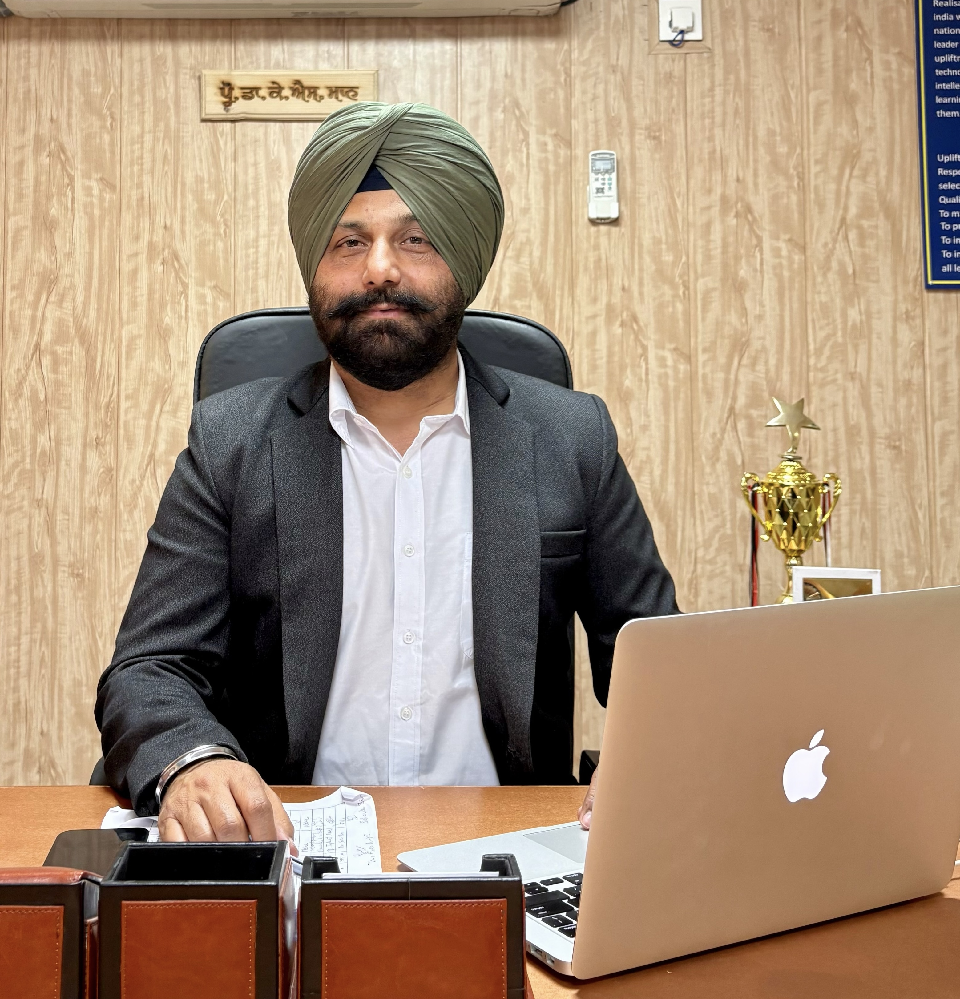
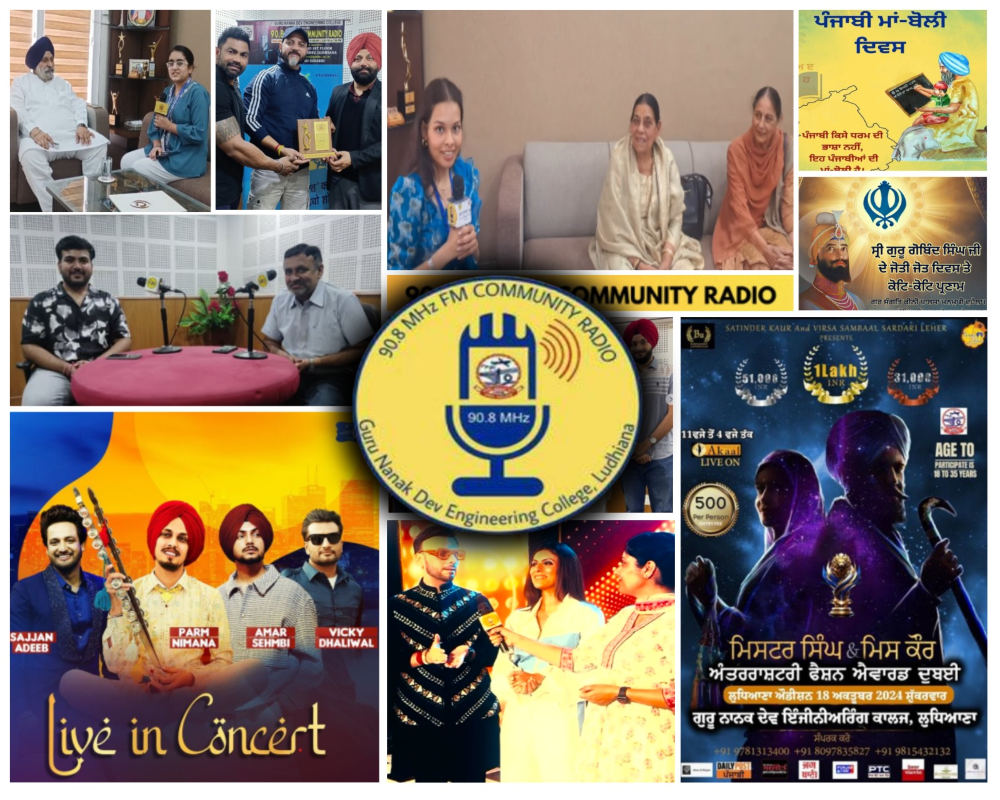
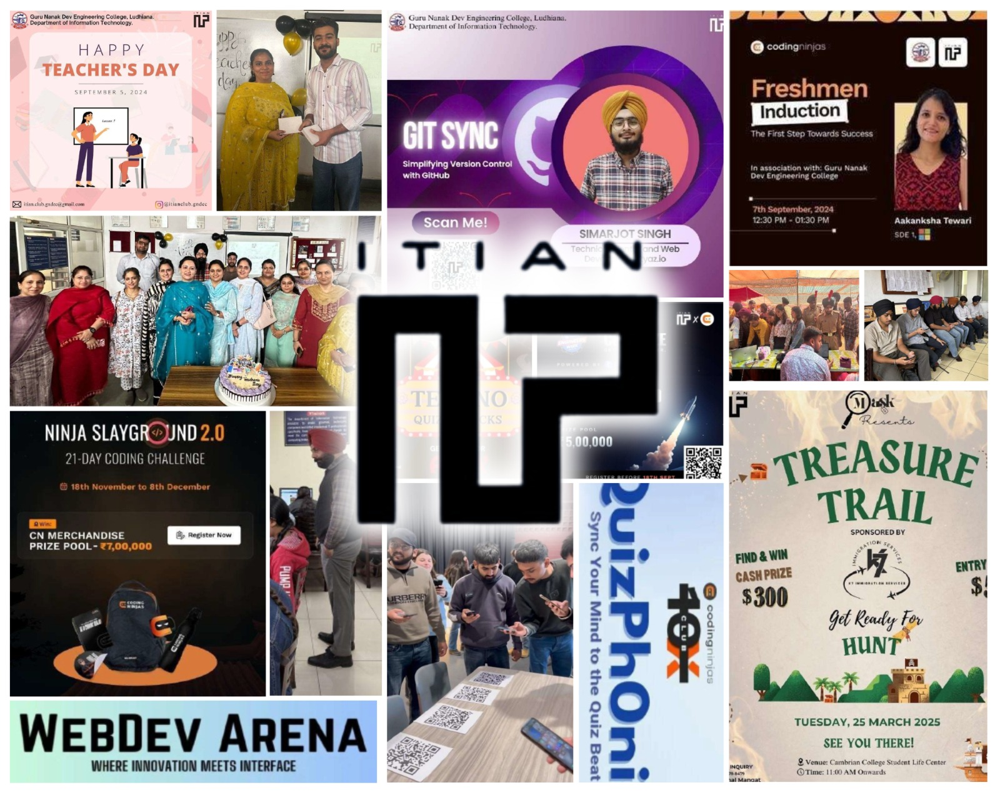
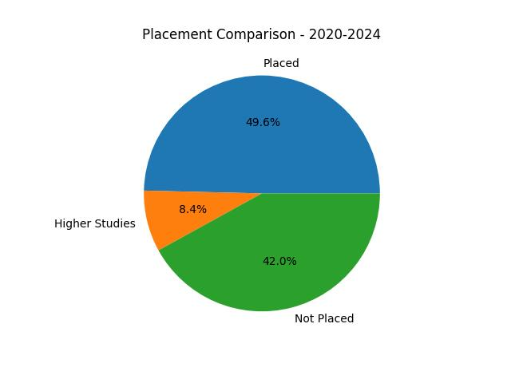
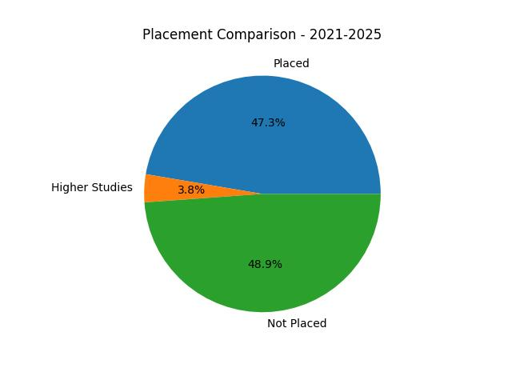

# Department of Information Technology

## Message from HoD's Desk

The Information Technology Department is dedicated to empowering students from diverse backgrounds, bridging the gap between urban and rural education through inclusive and innovative learning opportunities. The department’s approach to education extends beyond the classroom. It cultivates a culture of creativity, critical thinking, and problem-solving, encouraging students to think innovatively and independently. The department also emphasizes personal and professional development, offering a plethora of enriching activities such as technical workshops, hackathons, leadership initiatives, and career development programs. Alongside technical proficiency, the faculty prioritizes essential soft skills, teamwork, and ethical principles to nurture socially responsible and well-rounded individuals.The Information Technology Department stands as a beacon of excellence, committed to producing future-ready professionals equipped to meet global challenges, contribute meaningfully to society, and emerge as leaders in the field of technology and beyond.

## Department at Glimpse

  Undergraduate Engineeirng Program of Department of Information Technoloy has National Board of Accrediation (NBA) since 2008. 
   **Again the program has been accrediated by NBA  for the Academic years 2025-2026 to 2027-2028 i.e. till June 2028.**

  

## Faculty Achievements  

- 
Dr. Akshay Girdhar,Professor(IT) & Dr. Jagdeep Singh, Assistant Professor (IT) received an "Appreciation Certificate from Deputy Commissioner", Ludhiana on 9th August 2024.They have been actively involved as a consultant in various prestigious projects, showcasing their expertise and dedication to their field.

- 
 Dr. K.S.Mann, Dr.Amit Kamra & Dr. Pankaj Bhambri has been awarded with the design patent for Smart Helmet( Design No:382600-001).

- 
Dr. Akshay Girdhar,Professor(IT) & Dr. Jagdeep Singh, has developed and maintained the Admission Portal to ensure the smooth conduct of the complete admission process for all UG and PG courses.

- 
Dr. K.S.Mann, Professor and Head(IT),received the "Certification of Appreciation" in recognition of invaluable contributions as a Founder Member/Office Bearer/President of SLIET Alumini Association from SLIET Alumini Association dated on 9th February 2025.  
- 
Dr. Amit Kamra, Assistant Professor (IT),received "Indian Society of Technical Education (ISTE) Section Best Teacher Award 2024" for outstanding achievement in the field of technical education and research, hosted by Bhai Gurdas Institute of Engineering & Technology, Sangrur on 25th October 2024.
- 
Dr. K.S.Mann, Professor and Head(IT) and Dr. Amit Kamra, Assistant Professor(IT) has received Rs 2Lakh Grant for the AICTE VAANI held from 8th-10th August 2024 and 3.5 Lakh grant for ATAL FDP which held from 16th-21st December 2024.
  
- 
 Dr. Pankaj Bhambri, Assistant Professir(IT), has been recognized among the Top 2% Scientists in the World Ranking of Top 2% scientists" jointly published by Standard University & Elsevier(2025).

- 
Dr. K.S.Mann, Professor and Head(IT) and Dr. Pankaj Bhambri, Assistant Professor(IT) has received Rs 1Lakh Grant for the  for ATAL FDP which held from 30th-4th January 2024.
  
- 
 Dr. Sachin Bagga , Assistant Professor(IT), has successfully Completed Ph.D.(2024), got recognition from Infosys for active campuss connect activities and fellowship was awarded for attending 37th International Conference on VLSI Design.
- 
 Pf.Rupinder Kaur , Assistant Professor(IT), has received Best paper award in 11th International Conference on Advancements in Engineering & Technology.
- 
 Dr. Jagdeep Singh , Assistant Professor(IT), Awarded a patent titled “ IoT Enabled Cybersecurity Device ”(Patent No. 423830-001).

 
## Expert Talk 

 | Sr. No. | Name of Faculty  | Title of the Talk          | Event Name |Date    | Organised by   |
|:--------|:------------------------------------------------------------------------------------------------------------------------------------------------|:-------------------------------------------------------------------------------------------------------------|:---------|:---------------------------------|:----------------------------------------------------------------------------------------|
| 1 | Dr. Amit Kamra | Stress Management | Faculty Development Program  | 21st November 2024  |SBCE, Kerela|
| 2 | Dr. K.S.Mann | Workshop on Shell Programming | Linux Administration   | 6th June 2024  | GNDEC, Ludhiana | 
| 3 | Dr. Amit kamra | Optimization Using Orange   | Application of AI in Electronis     | 06th December  2024  |NITTR, Chandigarh| 
| 4 | Dr. K.S.Mann | Workshop on Shell Programming | Linux Administration   | 6th June 2024  | GNDEC, Ludhiana | 
| 5 | Dr. Amit Kamra | Digital Forensics  |Competetive Coding and Disruptive Tech.   | 09th December 2024  | CU, Chandigarh | 
| 6 | Dr. Amit Kamra | Visulaization uisng Ornage | GANS and Deep Learning  | 12th December 2024  | Chandigarh University, Chandigarh | 
| 7 | Pf. Harminder Kaur | Hands on with Github and Docker on Linux | Linux    | 15th July 2024  | GNDEC, Ludhiana | 
| 8 | Dr. Pankaj Bhambri | Workshop on Shell Programming | Linux Administration   | 6th June 2024  | GNDEC, Ludhiana | 
| 9 | Dr. Amit Kamra | Artificial Intelligencefor Research: Tools,Techniques, and Trends |  Faculty Development Program  | 14th January 2025  | Central University of Punjab, Bathinda | 
| 10 | Dr. Jagdeep Singh | Cybersecurity Awareness|  Linux Administration | 3rd April 2025  | Chandigarh University, Chandigarh | 
| 11 | Pf. Jasleen Kaur | Workshop on Shell Programming | Linux Administration   | 6th June 2024  | GNDEC, Ludhiana | 

## Publications  

- **
Dr. Sandeep Kumar Singla**, “Sentimental analysis using RNN, CNN, and LSTM: A comparative study of accuracy and computational efficiency”, Library Progress International, July 2024.
- **
Dr. Pankaj Bhambri**, “Sentimental analysis using RNN, CNN, and LSTM: A comparative study of accuracy and computational efficiency”, Library Progress International, July 2024.
- **
Dr. Jagdeep Singh**, “Sustainable machining of Inconel 718 using minimum quantity lubrication: Artificial intelligence-based process modelling”, Heliyon, August 2024.
- **
Dr. Randeep Kaur**, “Predictive Analytics & Validation for Technology Intervention Recommendation System for Autism: A Machine Learning Framework”, International Journal of INTELLIGENT SYSTEMS & APPLICATIONS in Engineering, July 2024.
- **
Dr. Jagdeep Singh**, “Modeling and optimization of hard turning: predictive analysis of surface roughness and cutting forces in AISI 52100 steel using machine learning”, International Journal on Interactive Design and Manufacturing , November 2024.
- **
Pf. Rupinder Kaur**,"Exploring the Role of Computer Vision in Product Design and Development: A Comprehensive Review", International Journal on Interactive Design and Manufacturing(IJIDeM), July 2024.
- **
Pf. Rupinder Kaur**,"Integrating Sustainable Energy Systems and Artificial Intelligence: Transforming the Future of Energy", Springer Scopus Indexed, December 2024.
- **
Dr. Jagdeep Singh**,"Renewable Energy Optimization for Distributed EV Charging Stations Using HBA and Smart Contracts",IEEE Internet of Things, March 2025.
- **
Dr. Pankaj Bhambri**,"nBLAST-JC: An accelerated deployment of nucleotide BLAST on high-performance cluster, Heliyon, May 2025.
- **
Dr. Palwinder Kaur**,"Deep Learning In Medical Imaging: Enhancing Diagnostic Accuracy, International Journal of Environmental Sciences,May 2025
- **
Dr. Randeep Kaur**,""Deep Learning In Medical Imaging: Enhancing Diagnostic Accuracy, International Journal of Environmental Sciences,May 2025.

## Events Attended (FDPs/Conferences/STCs/SDTs/Workshops/Webinars etc.)  

| Sr. No. | Name of Faculty  | Name of Event          | Duration |               Date(s)     |             Organizing Institute    |
|:--------|:----------------------------------------------------------------------------------------------------------------|:-------------------------------------------------------------------------------------------------------------|:-----------------------|:-----------------------------------------------------|:---------------------------------------------------------------------|
| 1 | Dr. Pankaj Bhambri| Hands on Github and Docker on Linux  | 3 Days   | 15th July to 17th July 2024 |GNDEC |
| 2 | Pf. Rupinder Kaur| Hands on Github and Docker on Linux  | 3 Days   | 15th July to 17th July 2024 |GNDEC |
| 3 | Pf. Jaskiran Kaur | Hands on Github and Docker on Linux  | 3 Days   | 15th July to  17th July 2024 |GNDEC |
| 4 | Pf. Himani Sharma | Hands on Github and Docker on Linux  | 3 Days   | 15th July to 17th July 2024 |GNDEC |
| 5 | Pf. Reema Verma | Hands on Github and Docker on Linux  | 3 Days   | 15th July to 17th July 2024 |GNDEC |
| 6 | Dr. Sidharath Jain | DevOps FEP    | One week   | 15th July to 19th July 2024 | Infosys Springboard |
| 7 | Pf. Gitanjali | Publishing in High-Impact Journals : Strategies for Effective Writing and Leveraging AI in Research     | 5 Days  | 22nd July to 26 July 2024| Banarsidas Chandiwala Institute of Professional Studies|
| 8 | Pf. Gagneet Kaur| Publishing in High-Impact Journals : Strategies for Effective Writing and Leveraging AI in Research     | 5 Days  | 22nd July to 26 July 2024| Banarsidas Chandiwala Institute of Professional Studies|
| 9 | Dr. Amit Kamra | 3 days Program on Role of IT in Millets Production AICTE Vanni   | 3 Days   | 8th August to 10th August 2024|AICTE VANNI|
| 10 | Pf.Rupinder Kaur| 3 days Program on Role of IT in Millets Production AICTE Vanni   | 3 Days   | 8th August to 10th August 2024|AICTE VANNI|
| 11 | Pf. Harjot Kaur Gill| Advanced Informative and Emerging Trends in Teaching and Research (Innovative Teaching and Learning Pedagogy)  | One week | 24 August to 30 August 2023|Institute of Marketing and Management, Delhi School Of Business Administration, Bhagwan Parshuram Institute Of Technology, Research Foundation of India & RFI-CARE|
| 12| Pf. Ranjodh Kaur | Deep Learning Application   | 2 Week   | 16 September to 27 September 2024| IIT Roorkee|
| 13 | Pf. Jagdeep Singh | Deep Learning Application   | 2 Week   | 16 September to 27 September 2024| IIT Roorkee|
| 14 | Dr. Kamaljit Kaur | Recent Research Trends in Computer Science and Information Technology   | One Week  | 23 September to 27 September 2024|Sharda University|
| 15 | Pf. Himani Sharma | Recent Research Trends in Computer Science and Information Technology   | One Week  | 23 September to 27 September 2024|Sharda University|
| 16 | Dr. Reema Verma| Recent Research Trends in Computer Science and Information Technology   | One Week  | 23 September to 27 September 2024|Sharda University|
| 17 | Dr. Randeep Kaur | Recent Research Trends in Computer Science and Information Technology   | One Week  | 23 September to 27 September 2024|Sharda University|
| 18 |Dr. Sandeep Kumar Singla |"Deep Learning for Engineering Applications"   | One week   | 2nd September - 6th September 2024| NITTR Chandigarh|
| 19 | Pf. Ranjodh kaur | Building Web Development Solutions with Cloud Computing  | 5 Days   | 17th September - 21st September 2024|Next Gen Employability Program, Edunet Foundation|
| 20| Dr. Randeep Kaur | Generative AI  | One week   |18th November to 22 November 2024|Infosys Springboard |
| 21| Pf. Harjot Kaur| Applied AI: Practical Implementations | One week   |  18th November to 22 November 2024| TechSaksham Program |
| 22|Dr. Sandeep Kumar Singla| Generative AI Unveiled: Concepts, Models, and Real-world Applications | One week   |  2nd December - 7th December 2024 |AICTE|
| 23|Pf. Ranjodh kaur| Faculty Enablement Program(FEP) on Python Programming | One week   |  9th December - 13th December|Infosys Springboard|
| 24 |Pf. Parminder Kaur Wadhwa | Incorporating sustainable development goals in Bringing out Industry Ready Professionals | One week   | 14th December - 19th December | ATAL Academy|
| 25|Dr. Randeep Kaur | Future Proofing Indias semiconductor Industry:Building Skilled Workforce | One week   |  16th Decemeber - 21st December 2024| ATAL Academy|
| 26|Pf. Gitanjali | Future Proofing Indias semiconductor Industry:Building Skilled Workforce | One week   |  16th Decemeber - 21st December 2024| ATAL Academy|
| 27| Dr. Pankaj Bhambri | Advanced Analytics for Next-Generation Industrial Processes| One week   |  23rd December to 28th December 2024|Atal Bihari Vajpayee Indian Institute of Information Technology and Management, Gwalior|
| 28| Pf. Jaskiran Kaur | Emerging Trends in Information System Security using AI & Data Science for Next- Generation Cyber | One week   |  30th December 2024 to 4th Januar 2025 | ATAL Academy|
| 29| Pf. Gitanjali | Emerging Trends in Information System Security using AI & Data Science for Next- Generation Cyber | One week   |  30th December 2024 to 4th Januar 2025 | ATAL Academy|
| 30| Dr. Kamaljit Kaur| Emerging Trends in Information System Security using AI & Data Science for Next- Generation Cyber  |One week   |  30th December 2024 to 4th Januar 2025 | ATAL Academy|
| 31| Dr. Amit Kamra| Emerging Trends in Information System Security using AI & Data Science for Next- Generation Cyber  |One week   |  30th December 2024 to 4th Januar 2025 | ATAL Academy|
| 32| Dr. Jagdeep Singh| Emerging Trends in Information System Security using AI & Data Science for Next- Generation Cyber | One week   |  30th December 2024 to 4th January 2025 | ATAL Academy|
| 33| Dr. Jagdeep Singh| Cyber Security and Intrusion Detection Forensics  |One Week  |  20th January to 25th January 2025 | ATAL Academy|
| 34| Pf. Himani Sharma | Intelligent Computing Techniques and Its Engineering Applications |One Week  |  6th January to 10th January 2025 | ATAL Academy|
| 35| Pf. Harminder Kaur | Intelligent Computing Techniques and Its Engineering Applications |One Week  |  6th January to 10th January 2025 | ATAL Academy|
| 36| Pf. Reema Verma | Intelligent Computing Techniques and Its Engineering Applications |One Week  |  6th January to 10th January 2025 | ATAL Academy|

## Student's Corner 

## GATE Qualified Students

| S.No.                      | Name of Student                      | Enrollment ID                                           | Year | 
|:-----------------------------------------------------------------------------------------------------------------|:-----------------------------------------------------------------------------------------------------------------|:--------------------------------------------------------------|:---------|
| 1      | Naunihal Singh  |  T456J19 | 2024  | 
| 2      | Devesh Sharma    |  R523B90 | 2025  | 

   
## Students who cleared NPTEL MOOC’s courses

| Sr.No. | Name                    | Course Name                           |       
|:--------|:-------------------------|-----------------------------------------------
| 1      | Armaan Wadhwa          |  Introduction to Industry 4.0 and Industrial Internet of Things |
| 2      | Brahmjot Singh          | Data Analytics with Python|                            
| 3      | Brahmjot Singh             | Introduction to Industry 4.0 and Industrial Internet of Things                        
| 4      | Brahmjot Singh         | Ethical Hacking                         
| 5      | Taranpreet Kaur         | Social Networks                           
| 6      | Armaan Wadhwa           | Privacy and Security in Online Social Media                         
| 7      | Armaan Wadhwa        |  Applied Accelerated Artificial Intelligence                        
| 8      | Jashanjot Singh         | Problem solving through Programming in C|                          
| 9      | Ansh Kumar       | Blockchain and its Applications                          
| 10     | Ansh Kumar         | Affective Computing                         
| 11     | Ansh Kumar         | Data Analytics with Python                            
| 12     | Ansh Kumar       | Introduction to Industry 4.0 and Industrial Internet of Things                           

## Students of IT bagged various positions in Sports  

| Sr.No. | Name                    | Achievements   |                                           
|-------|------------------|-----------------------------------------------------------------------------------------|
| 1     |  Anu Grewal  | Recognized for outstanding performance in cycling, clinching the title of Best Cyclist at PTU |
| 2     |  Anu Grewal  | 1st place in High Jump at PTU athletic meet |
| 3     |  Sunny Kumar  | Member College Wt. lifting Team(Gold medal in PTU) |
| 4     |  Sunny Kumar  | Member College Handball Team;2nd in PTU |
| 5     |  Sunny Kumar  | 1st in Inter-yr Kabaddi League 
| 6     |  Trisha | Secured Inter College Gold in Lawn Tennis |
| 7     |  Vansh Singh | Secured Inter College silver in Badminton |               
| 8     |  Ajayvir Singh |  3rd in PTU Inter College Table-Tennis Toournament |
| 9     |  Raghav Sharma |   1st in GNDEC Inter-Year Kabaddi League|
| 10     |  Karan Yadav |    1st in GNDEC Inter-Year Kabaddi League |
| 11     |  Manpreet Singh |     1st in GNDEC Inter-Year Football League|
| 12     |  Arshpreet Singh|    2ND IN GNDEC Inter-Year Football League |
| 13      |  Jasmeet Nain|     1st in GNDEC Inter-Year Football League |
| 14      |  Eshan Sharma|     1st in GNDEC Inter-Year Cricket Tournament |

###  Extracuricular Achievements

## Innovative Events and Technical Activities Led by the Department of Information Technology through the ITian Club

- 
The ITIAN Club, established in 2021, is a dynamic technology-driven initiative dedicated to fostering innovation and technical excellence among students. Open to all who have a passion for technology and its real-world applications, the club serves as a vibrant platform for learning, collaboration, and skill development.
 - 
Through a variety of engaging events, hands-on workshops, and interactive sessions, the ITIAN Club encourages members to explore emerging technologies and enhance their practical knowledge. It continues to empower students by nurturing creativity, technical competence, and a spirit of innovation.

**TEAM MEMBERS**

 | CORE TEAM |                                         
|---------|
Coordinator - Ashmeet Kaur
Co-Coordinator - Simarjot Singh
Public Relations Officer - Abhishek
Secretary - Harsh Kapoor
HR- Arshdeep Kaur

| SUB- CORE TEAM |                                         
|---------|
Event Management Head - Saarvi
Creative Head - Priyanshu
Database Head - Jasmeet Kaur
Discipline Head - Harmanpreet Singh
Content Head - Parkhi Gupta
Technical Head - Brahamjot Singh
Social Media Head - Taranpreet Kaur
Software Head - Jasnoor Kaur

| Sr.No. | Name of the Activity/Event                  | Date                           |       
|-------|----------------------------|-----------------------------------------------------------------------------------------|
|  1     | ORIENTATION PROGRAM 2024-2025           | 16th July 2024      |
|  2     | CODING NINJA                        | 7th September 2024      |
|  3     | GIT SYNC                       | 12th September 2024      |
|  4     | CODEKAZE                       | 18th September 2024       |
|  5     | TECHNO: QUIZ and TRICKS                       | 25th October 2024        |
|  6     | NINJA SLAYGROUND 2.0                       | 18th November 2024        |
|  7     | WEBDEV ARENA                       | 27th February 2025      |
|  8     | TREASURE TRAIL                        | 25th March 2025      |
|  9     | QuizPhOnic                      | 23rd April 2025      |

  

## Placements

**Batch : 2021-2025**

| Sr. No. | Candidate Name       | Company Name                               | Package (LPA) |
|:--------|:---------------------|:-------------------------------------------|:--------------|
| 1       | Anushka Negi         | Accelor Microsystems                       | 4.8           |
| 2       | Aashish Bindha       | Wits Innovation Lab                        | 4.2           |
| 3       | Abhishek Kumar       | Cropsly                                    | 4             |
| 4       | Aman                 | Infosys                                    | 3.6           |
| 5       | Anjali Singh         | Antier Solutions Pvt Ltd                   | 4             |
| 6       | Ansh Kumar           | Infosys                                    | 3.6           |
| 7       | Anu Grewal           | Infosys                                    | 3.6           |
| 8       | Arsh Preet Singh     | Cognizant                                  | 4             |
| 9       | Arshpreet Singh      | Airtel                                     | 3.6           |
| 10      | Ashutosh Kumar       | Booking Koala                              | 3             |
| 11      | Astha Bhanot         | Safeaeon non technical Presenter           | 4.2           |
| 12      | Avlyn Kaur Khurana   | Infosys                                    | 3.6           |
| 13      | Ayush Singh          | Wits Innovation Lab                        | 4.2           |
| 14      | Eshan Sharma         | Infosys                                    | 3.6           |
| 15      | Gagandeep Kaur       | Venture Pact                               | 4.2           |
| 16      | Gargi Jangra         | Wits Innovation Lab                        | 4.2           |
| 17      | Gaurav               | GlowLogics Solutions Pvt. Ltd.             | 5.2           |
| 18      | Gurjot Singh         | TTEC                                       | 3             |
| 19      | Gurneet Singh        | 75way Technologies Pvt. LTD.               | 3.6           |
| 20      | Gurpartap Singh      | Infosys                                    | 3.6           |
| 21      | Harjot singh         | Clay HR                                    | 4             |
| 22      | Harleen Kaur         | Wits Innovation Lab                        | 4.2           |
| 23      | Inzamamul Houqe      | Infosys                                    | 3.6           |
| 24      | Jasmeen Kaur Gill    | Airtel                                     | 3.6           |
| 25      | Kunal Rawat          | Infosys                                    | 3.            |
| 26      | Mankirat Singh       | SafeAeon                                   | 4.2           |
| 27      | Manpreet Kaur        | GlowLogics Solutions Pvt. Ltd.             | 5.2           |
| 28      | Manpreet Kaur        | Wits Innovation Lab                        | 4.2           |
| 29      | Md. Raihan Shamin    | Stellaraa Edu Tech Pvt Ltd                 | 12            |
| 30      | Natasha              | Venture Pact                               | 4.2           |
| 31      | Naunihal Singh       | Cognizant (GenC Select)                    | 4             |
| 32      | Navjot Singh         | Wits Innovation Lab                        | 4.2           |
| 33      | Navneet Kaur         | Wits Innovation Lab                        | 4.2           |
| 34      | Navpreet Kaur        | Clay HR                                    | 4             |
| 35      | Parvinder Singh      | Wits Innovation Lab                        | 4.2           |
| 36      | Prashant Singh Yadav | Wits Innovation Lab                        | 4.2           |
| 37      | Pratham Goyal        | eNest Technologies Private Limited         | 4             |
| 38      | Priya                | eNest Technologies Private Limited         | 4             |
| 39      | Puneet Walia         | Infosys                                    | 3.6           |
| 40      | Rajat Garg           | Cropsly                                    | 4             |
| 41      | Santa Singh          | Cognizant (GenC Select)                    | 4             |
| 42      | Shabnam              | Stellaraa Edu Tech Pvt Ltd                 | 12            |
| 43      | Shivam               | Step2Gen Technologies                      | 3.6           |
| 44      | Shivshant Prasad     | Infosys                                    | 3.6           |
| 45      | Shubham Kumar        | Cognizant (GenC Next Select)               | 6.75          |
| 46      | Tanya Sood           | Stellaraa Edu Tech Pvt Ltd                 | 12            |
| 47      | Vaishnavi Bharambe   | HCL Technologies                           | 4.25          |
| 48      | Yash                 | Infosys                                    | 3.6           |

**Batch : 2020-2024**

| Sr. No. | Candidate Name       | Company Name                               | Package (LPA) |
|:--------|:---------------------|:-------------------------------------------|:--------------|
| 1       | Neeraj Kumar         | Antier solutions                           | 4.0           |
| 2       | Chandan Kumar        | Argusoft                                   | 7.12          |
| 3       | Himanshu Mahajan     | Stylumia Intelligence Technology Pvt. Ltd. | 7             |
| 4       | Lovish Malhotra      | JMAN Group                                 | 5             |
| 5       | Ananya Mahajan       | KPMG                                       | 5             |
| 6       | Harleen Kaur         | SafeAeon Inc.                              | 4.12          |
| 7       | Gaganpreet Singh     | SafeAeon Inc.                              | 4.12          |
| 8       | Ravleen Kaur         | Airnet Travels and Cargo Pvt. Ltd.         | 3.6           |
| 9       | Shubham Choudhary    | Airnet Travels and Cargo Pvt. Ltd.         | 3.6           |
| 10      | Divyansh Bhateja     | WITS INNOVATION LAB                        | 3.5           |
| 11      | Prabhkirat Singh     | WITS INNOVATION LAB                        | 3.5           |
| 12      | Prabhjot Singh       | MWIDM                                      | 3.5           |
| 13      | Preet Singh Sahota   | MWIDM                                      | 3.5           |
| 14      | Amandeep Singh       | MWIDM                                      | 3.5           |
| 15      | Monika               | JMAN Group                                 | 5             |
| 16      | Kumar Abhinav        | Iotasol Technologies Pvt. Ltd.             | 2.7           |
| 17      | Hemant Sahdev        | Airnet Travels and Cargo Pvt. Ltd.         | 2.7           |
| 18      | Sejal Madaan         | PIRAMAL GROUP                              | 2.5           |
| 19      | Harmanpreet Kaur     | Ralson (India) Limited                     | 2.4           |
| 20      | Aman Kumar           | Deepak Fasteners                           | 2.16          |
| 21      | Ravi Ranjan Kumar    | Deepak Fasteners                           | 2.16          |
| 22      | Prerna Sharma        | KPMG                                       | 5             |
| 23      | Harsh Mishra         | Nebero Systems Private Limited             | 6             |
| 24      | Sehajbir Singh       | SafeAeon Inc.                              | 4.12          |
| 25      | Sakshi Pundir        | SafeAeon Inc.                              | 4.12          |
| 26      | Palakpreet Kaur      | ShortHill Tech                             | 4.8           |
| 27      | Diksha               | ShortHill Tech                             | 4.8           |
| 28      | Harsh Mishra         | TCS                                        | 7             |
| 29      | Muskan Saini         | Capgemini                                  | 4             |
| 30      | Abhishek Kumar       | TCS(Digital)                               | 7             |
| 31      | Prabhjot Singh       | TCS (Ninja)                                | 3.36          |
| 32      | Amay Avasthi         | TCS (Ninja)                                | 3.36          |
| 33      | Ajit Kumar           | TCS (Prime)                                |  9            |
| 34      | Navneet Kaur         | Airnet Travels and Cargo Pvt. Ltd.         | 2.16          |
| 35      | Harjobandeep Singh   | Airnet Travels and Cargo Pvt. Ltd.         | 2.16          |
| 36      | Aditya Kumar Tulsyan | AlphaNumeric Ideas Pvt. Ltd                | 2.5           |
| 37      | Ayush Shekhar        | AlphaNumeric Ideas Pvt. Ltd                | 2.5           |
| 38      | Kumari Shushma       | AlphaNumeric Ideas Pvt. Ltd                | 2.5           |
| 39      | Jasmeet Singh        | AlphaNumeric Ideas Pvt. Ltd                | 2.5           |
| 40      | Neeraj Kumar       | BizMerlin HR.                                | 4.82          |

## Placement Summary

| Item                                                                     | 2021-2025 | 2020-2024 |
|--------------------------------------------------------------------------|-----------|-----------|
| Total Number of Final year students                                      | 131       | 131       |
| No. of students placed in Companies or Government sector                 | 62        | 65        |
| No. of students admitted to higher studies with valid Qualifying scores  | 5         | 11        |

          
 

