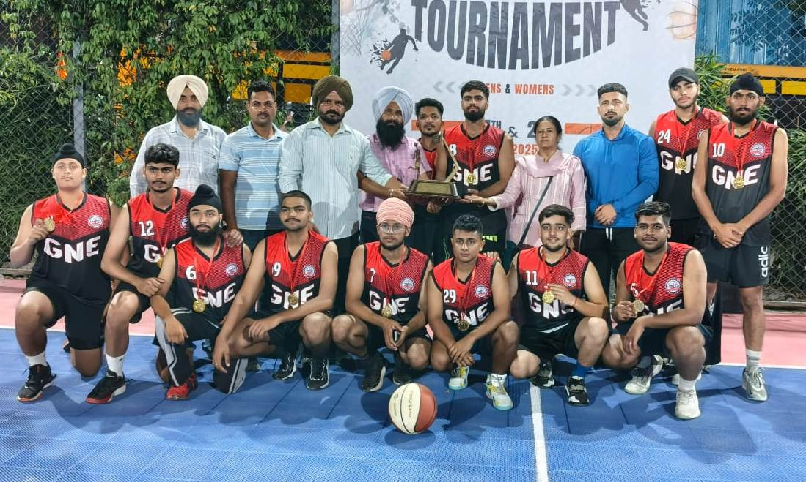
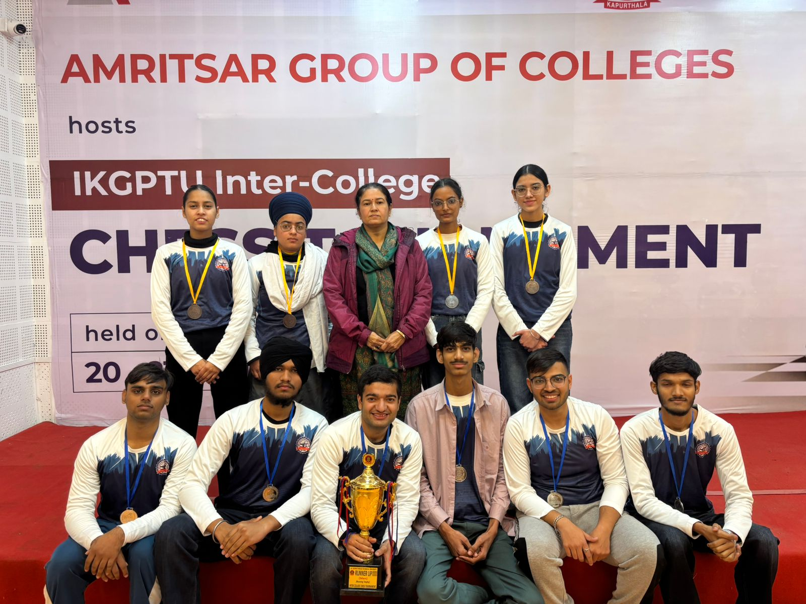
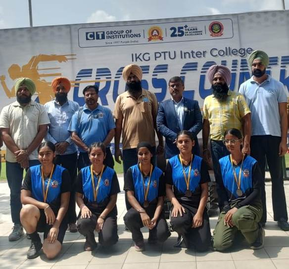
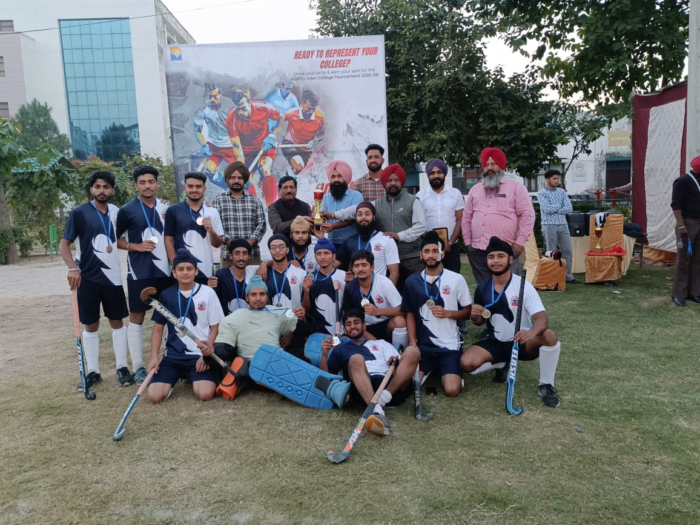

# Extramural Activities
## PTU Inter-college Tournaments

  

**Jasnoor Kaur of B.Tech - CSE 4th  year(2104128) became IKG-PTU BEST CYCLIST  in PTU Inter-college Cycling Competition at PAU "Velodrome",Ludhiana   on 1st October 2024**  

  
  

**Anu Grewal of B.Tech - IT 4th  year(2104471) became IKG-PTU BEST CYCLIST  in PTU Inter-college Cycling Competition at PAU "Velodrome",Ludhiana   on 1st October 2024**  

  
 

**IKGPTU Inter-varsity Participation**

| Sr. No. | Name               | Roll No. | Branch              | Game        | Venue                               | Dates                         | Photograph                                |
|:--------|:-------------------|:---------|:--------------------|:------------|:------------------------------------|:------------------------------|:------------------------------------------|
| 1.      | Nikhal Singh       | 2204002  | B.Tech. 3rd yr ME   | Kabaddi     | Lovely Professional University      | 13th to 16th November 2024    |              |
| 2.      | Prabhjot Singh     | 2104546  | B.Tech. 4th yr IT   | Basketball  | Kurukshetra University              | 25th to 28th November 2024    |            |
| 3.      | Anmol Singh        | 2104242  | B.Tech. 4th yr EE   | Basketball  | Kurukshetra University              | 25th to 28th November 2024    |               |
| 4.      | Saumya Dhingra     | 2302667  | B.Tech. 2nd yr CSE  | Basketball  | Kurukshetra University, Kurukshetra | 25th to 28th November 2024    |              |
| 5.      | Manvir Singh       | 2302396  | B.Tech. 2nd yr CE   | Basketball  | Kurukshetra University, Kurukshetra | 25th to 28th November 2024    |              |
| 6.      | Davinderpal Singh  | 2316104  | B.Tech. 2nd yr      | Basketball  | Kurukshetra University, Kurukshetra | 25th to 28th November 2024    |         |
| 7.      | Sushant Pal        | 2416087  | B.Tech. 1st yr EE   | Badminton   | Chitkara University, Chandigarh     | 30th Oct to 1st Nov 2024      |             |
| 8.      | Vansh Singh        | 2203907  | B.Tech. 3rd yr IT   | Badminton   | Chitkara University, Chandigarh     | 30th Oct to 1st Nov 2024      |               |

***IKGPTU CYCLING COMPETITION***

