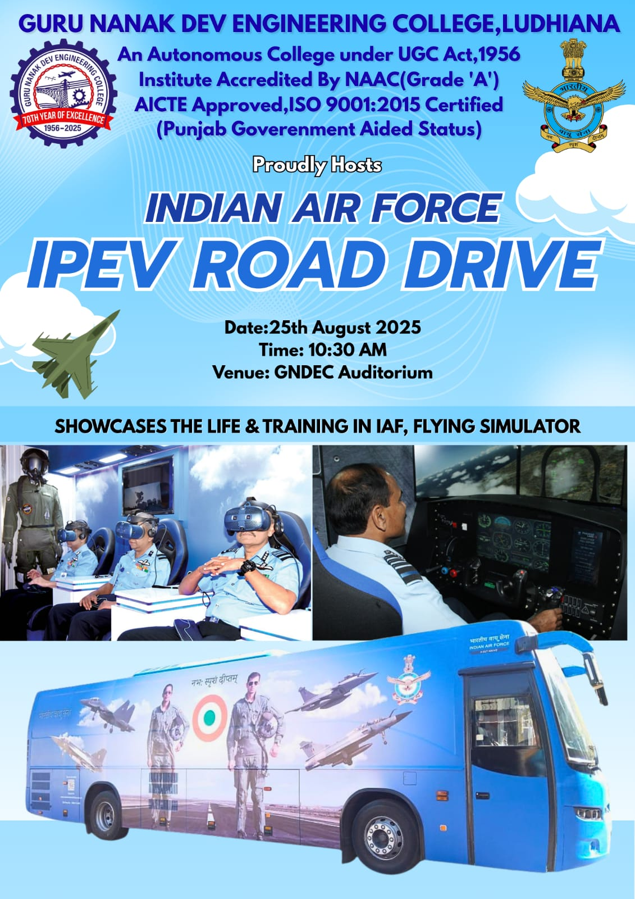
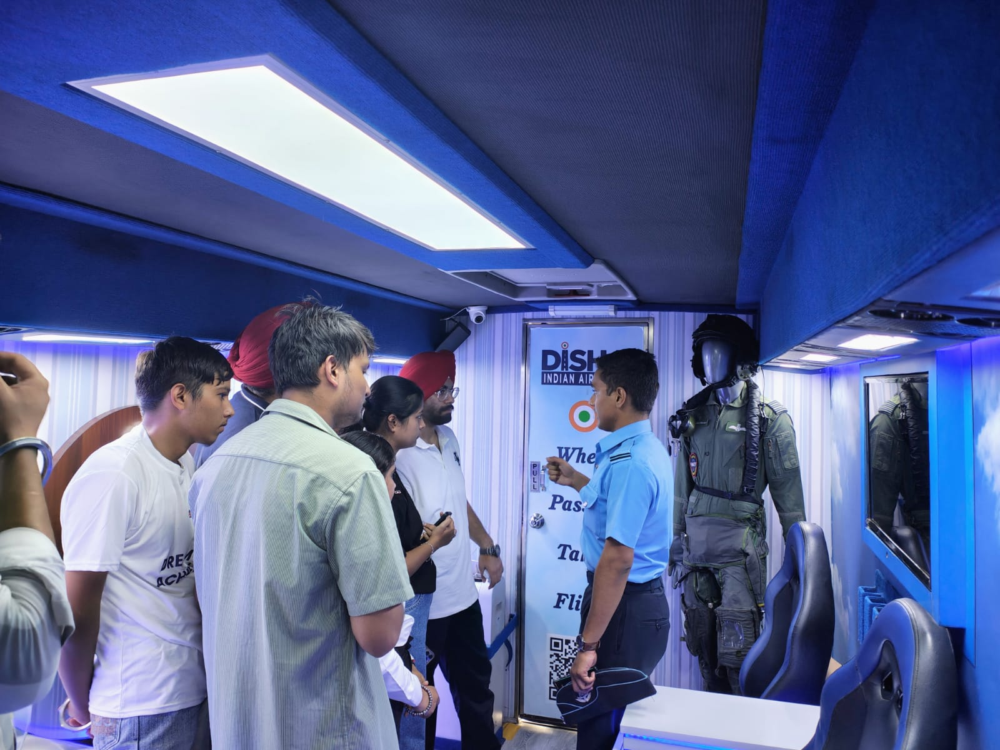
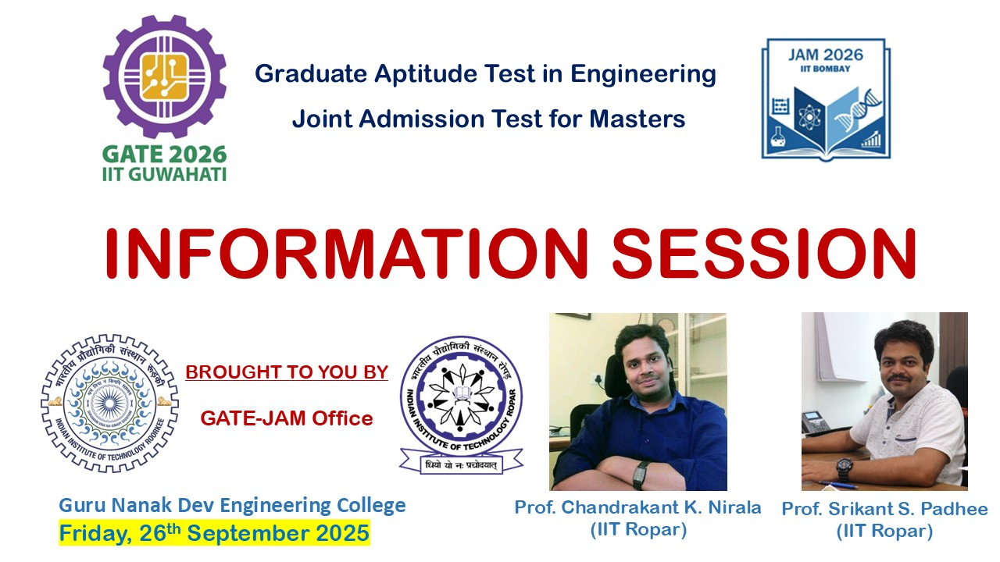
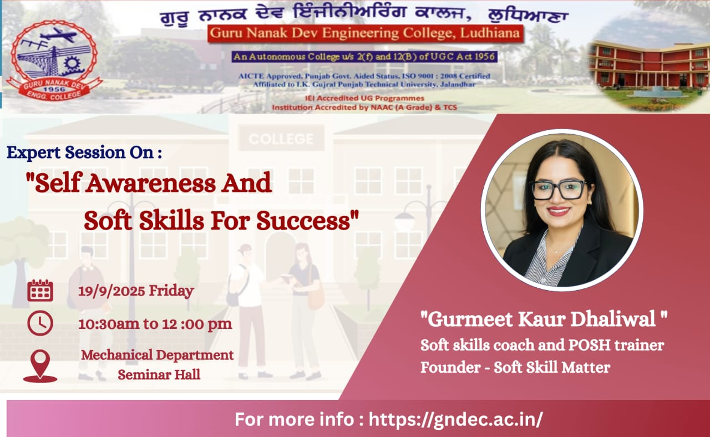
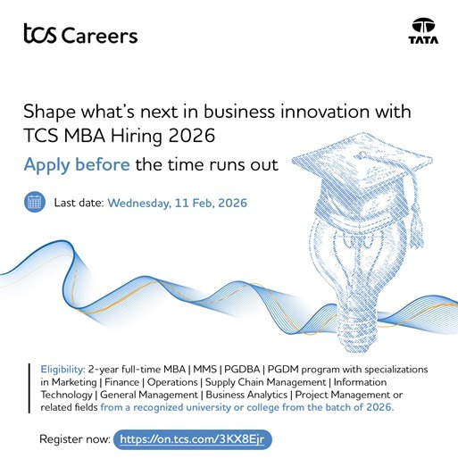
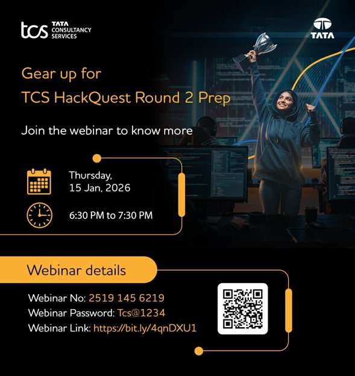
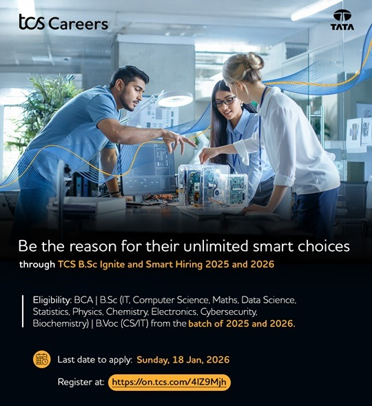

---

## Industry Engagement and Student Development Activities – 2025

### Events held in collaboration with Mahindra & Mahindra

The Training and Placement Cell organized events in collaboration with Mahindra & Mahindra to provide students with valuable industry exposure and corporate interaction opportunities. These engagements focused on strengthening industry-academia relationships and enhancing student awareness regarding real-world engineering applications, career prospects, and professional development pathways. The initiative aimed at bridging the gap between academic learning and industrial expectations while fostering recruitment opportunities for students.

 

### Industry Engagement and Student Development Activities – 2025

<table>
<tr>
<td></td>
<td></td>
<td></td>
</tr>

<tr>
<td></td>
<td></td>
<td></td>
</tr>

<tr>
<td></td>
<td></td>
<td></td>
</tr>

</table>

---
