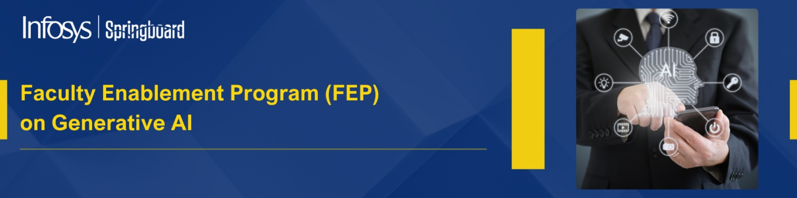
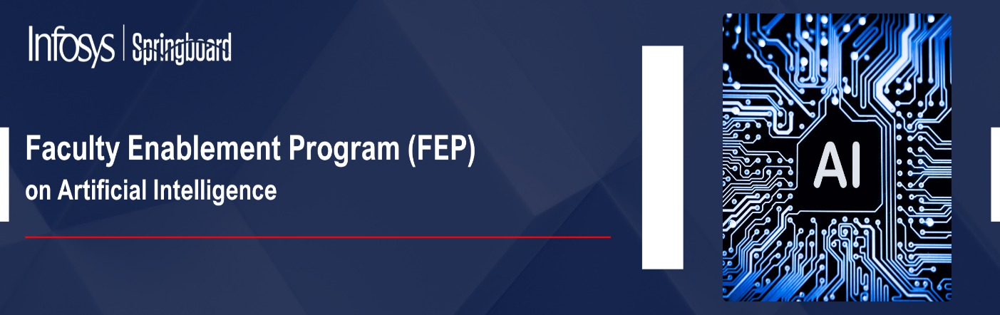
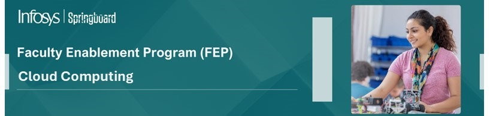
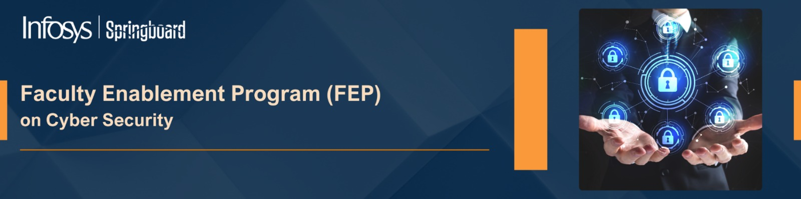
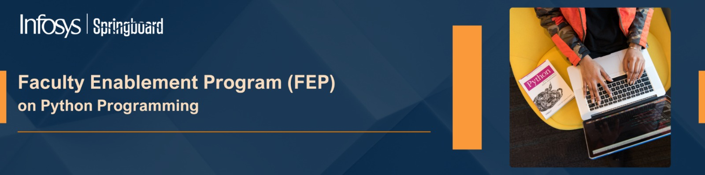
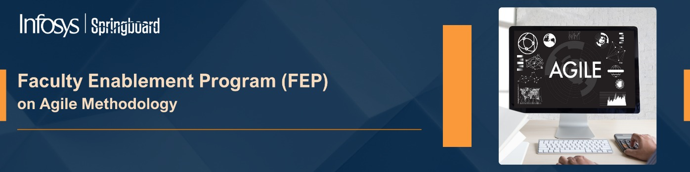
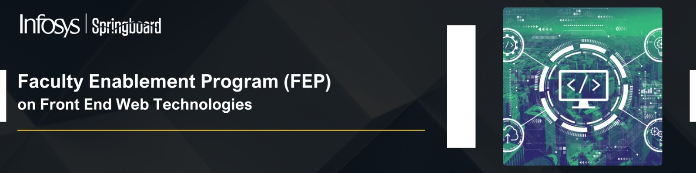

## Events held in collaboration with Infosys

 

## Faculty Enablement Program(FEP)

---
\

---
\

---
\

---
\

---
\

---
\

---
\

---
\

 

## Summer Training with Infosys

Training and Placement Cell gave an opportunity for B.Tech. (CSE, IT, ECE) students completing their 2nd and 3rd years to participate in a 4-week *Summer Training Program* under Infosys’ Campus Connect Initiative. Scheduled for July–August 2023, these online, self-paced courses on the Infosys Springboard platform focus on cutting-edge technologies such as Artificial Intelligence, Data Science, Cybersecurity, and Python.  

Participation is optional, with no financial burden on students. Successful completion involves proctored exams, weekly assessments, and internal evaluations, contributing to the TR-102 and TR-103 course credits. This program offers an excellent opportunity to upskill and earn industry-recognized certifications in emerging technologies.

Approximately 1100 students participate in the same

