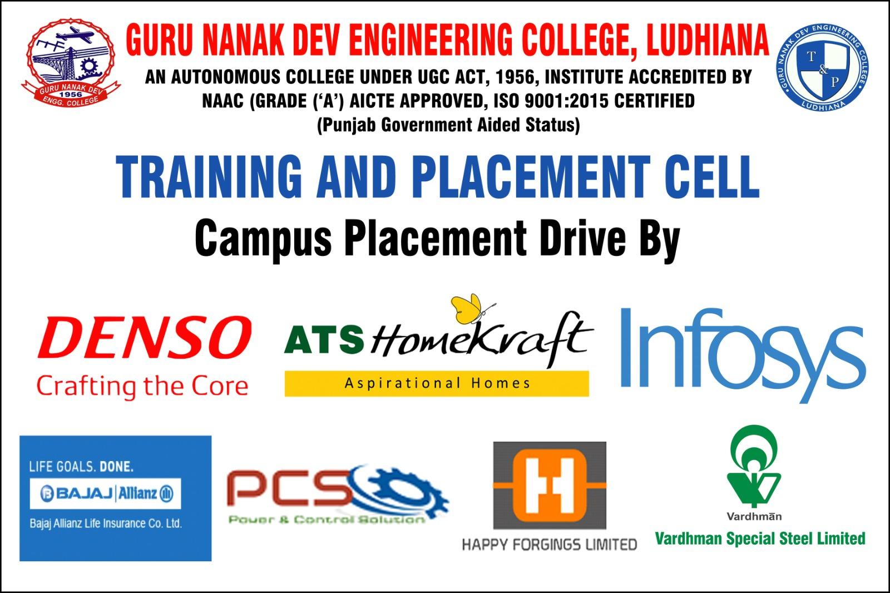
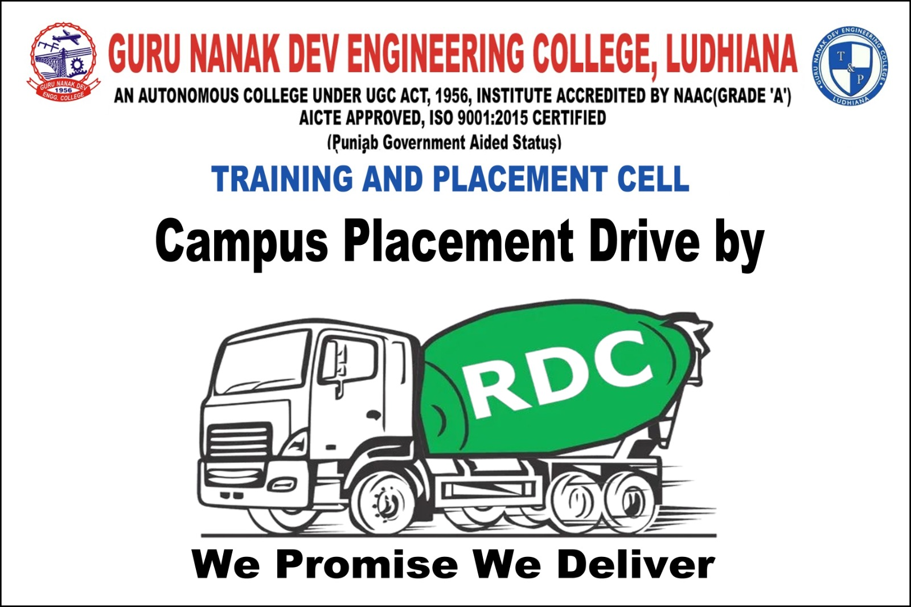
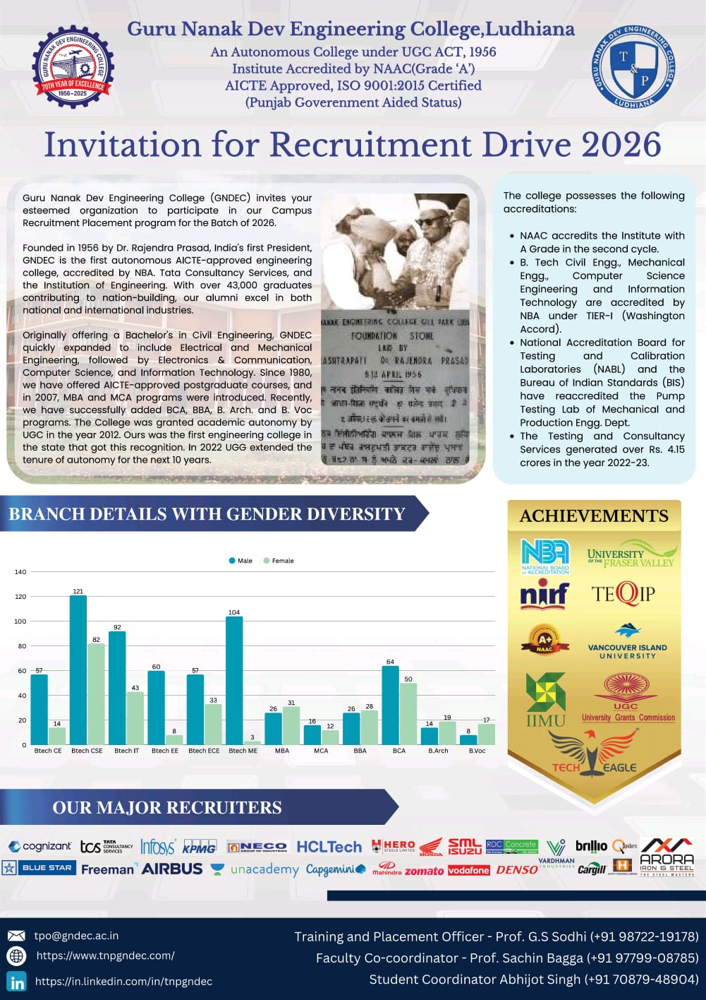
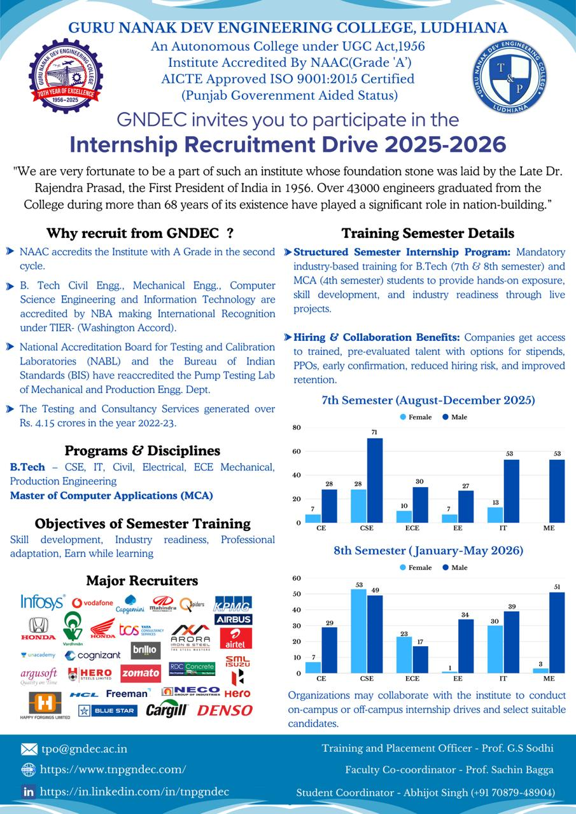

# Training And Placement Cell

The Training and Placement Cell of Guru Nanak Dev Engineering College (GNDEC), Ludhiana, serves as a vital link between academia and industry, fostering career opportunities for students while addressing the evolving needs of the professional world. Dedicated to enhancing employability and ensuring holistic development, the cell organizes pre-placement training programs, expert lectures, and industry interactions to equip students with the skills and confidence required for their professional journey. With a strong network of esteemed recruiters, GNDEC's Training and Placement Cell consistently facilitates internships and placements across diverse sectors, ensuring a bright future for its graduates.    

---

## Message from TPO's Desk:  Prof. G.S.Sodhi

    

At Guru Nanak Dev Engineering College, Ludhiana, we are committed to empowering students with the skills, knowledge, and confidence needed to succeed in the professional world. Our Training and Placement Cell consistently works to bridge the gap between academia and industry, preparing students for the evolving demands of modern workplaces.

The recent placement season reflects the collective dedication of our students, faculty, and recruiters. Renowned organizations across various sectors have recognized GNDEC’s talent, offering rewarding career opportunities. Our emphasis on technical training, soft skills development, and real-world exposure has played a key role in achieving excellent placement results.

I sincerely thank our recruiting partners for their continued trust and support. To our students, I encourage you to aim high, keep learning, and make the most of every opportunity as we continue to uphold the proud legacy of GNDEC.

 

## Training and Placement Activity Report 

Despite the challenges posed by the global recession and overall industry slowdown, the college administration and the Training & Placement Cell worked proactively to attract reputed companies across diverse sectors, ensuring that students continued to receive strong placement and internship opportunities. Through persistent outreach, strengthened industry relationships, and continuous student skill development, the institution successfully secured remarkable placement outcomes, enabling students to gain maximum benefit even in a highly competitive job market.

The Training and Placement Cell proudly present an excellent placement season, marked by strong industry participation, diverse job profiles, and competitive packages across IT, non-IT, and core engineering domains. Students secured outstanding opportunities in leading companies, with several premium recruiters. Josh Technology Group offered packages of ₹11.3 LPA, followed by Infosys Limited (Specialist Programmer - L1) at ₹10 LPA. Argusoft India Ltd. offered packages of ₹7.12 LPA, while companies such as DENSO International India Pvt. Ltd. and Cognizant Technology Solutions (GenC Next Select) continued their consistent hiring trend by offering packages of ₹6.9 LPA and ₹6.75 LPA, respectively. Century Plyboards (I) Ltd. and PlanetSpark offered packages of ₹6.5 LPA, while Infosys Limited (Digital Specialist Engineer) extended offers of ₹6.25 LPA. Nebero Systems Pvt. Ltd. and Stellaraa Edutech Pvt. Ltd. offered packages of ₹6 LPA, reflecting the strong demand for the college’s skilled talent pool.

Several reputed companies, including Bharti Airtel Limited, Glowlogics Solutions Pvt. Ltd., ClayHR, 75way Technologies Ltd., ElectroMech Material Handling Systems (India) Pvt. Ltd., and Pigeon Education Technology India Private Limited, hired students at attractive packages ranging between ₹5–5.5 LPA, demonstrating the diverse opportunities available across technology, consulting, telecom, and engineering domains. The college also witnessed significant hiring from core and infrastructure companies such as Rockman Industries Limited, Vardhman Special Steels Limited, and Vardhman Textiles Limited, with offers around ₹4.5 LPA. Major IT and technology companies including HCL Technologies Limited, Accelor Microsystems, Mahindra Swaraj (Mahindra & Mahindra Ltd.), MeritHub Technologies Pvt. Ltd., SafeAeon Inc., Antier Solutions Pvt. Ltd., Cognizant Technology Solutions (GenC Pro Select, GenC Select), Mehta Hitech Industries Limited, and Shapoorji Pallonji & Company Private Limited provided opportunities in the ₹4–4.25 LPA segment.

A broad range of companies offered packages in the ₹3.6–3.84 LPA category, including Homelife Buildcon Pvt. Ltd., eNest Technologies Pvt. Ltd., ATS HomeKraft, HomeKraft Infra Pvt. Ltd., IndiaMART InterMESH Ltd., Infosys Limited, RDC Concrete (India) Pvt. Ltd., and Wits Innovation Lab, indicating strong hiring momentum across both IT services and core sectors. Additional recruiters such as Agile Capital Services, House of Aarch, Prime Steel Processors, Arora Iron & Steel Rolling Mills Pvt. Ltd., Consort Builders Pvt. Ltd., Guru Nanak Auto Enterprises Limited, Ralson (India) Limited, and KGOC Global also offered promising roles in the ₹3.17–3.5 LPA range. Companies such as Bharat Bijlee Limited, Booking Koala, International Tractors Limited (Sonalika), Livspace, Modern Automotives Limited, Pearce Services, Step2Gen Technologies Pvt. Ltd., and TTEC Holdings, Inc. continued to contribute significantly by offering roles at ₹3 LPA, adding to the overall placement volume.

The Training and Placement Cell has also placed a strong emphasis on skill-building and experiential learning, enabling students to gain hands-on exposure through a wide range of paid internships across reputed companies and national institutions. These extensive internship engagements reflect the institution’s unwavering commitment to enhancing student competencies, improving industry readiness, and fostering an environment of practical, project-based learning.

 

---

## Major Recruiters

\

---\

---\

---\

---\

---
\

---
\

---
\

---
\

---

 

---

## Invitation for Placements and Internships

\

---
\

\

## Training And Placement Student team

\

---

Guru Nanak Dev Engineering College also has an active training and placement cell in order to assist our students in identifying their ambitions and life goals in the trending competitive placement market. T&P provides the infrastructural facilities to conduct group discussions, tests and interviews besides catering to other logistics.

The Training & Placement Cell was applauded for its efforts and achievements by a national daily.

We have a training placement team which includes Student Coordinators, Deputy Coordinators, Co-coordinators, Student moderators, Student Advisor, Database head Administrator, Public relation officer, Media Head, Executive Team, Who perform their duties well and efficiently.
  

---

## Placement Insights

| Company Name                                                     | Package (LPA) |
|------------------------------------------------------------------|---------------|
| Josh Technology Group                                           | 11.3          |
| Infosys Limited (Specialist Programmer - L1)                   | 10            |
| Argusoft India Ltd.                                            | 7.12          |
| DENSO International India Pvt. Ltd.                            | 6.9           |
| Cognizant Technology Solutions (GenC Next Select)              | 6.75          |
| Century Plyboards (I) Ltd.                                     | 6.5           |
| PlanetSpark                                                    | 6.5           |
| Infosys Limited (Digital Specialist Engineer)                  | 6.25          |
| Nebero Systems Pvt. Ltd.                                       | 6             |
| Stellaraa Edutech Pvt. Ltd.                                    | 6             |
| Bharti Airtel Limited                                          | 5.5           |
| Glowlogics Solutions Pvt. Ltd.                                 | 5.2           |
| ClayHR                                                         | 5.18          |
| 75way Technologies Ltd.                                        | 5             |
| ElectroMech Material Handling Systems (India) Pvt. Ltd.       | 5             |
| Pigeon Education Technology India Private Limited              | 5             |
| HDFC Life Insurance Company Limited                            | 4.75          |
| VenturePact                                                    | 4.63          |
| ITC Limited                                                    | 4.62          |
| Rockman Industries Limited                                     | 4.5           |
| Vardhman Special Steels Limited                                | 4.5           |
| Vardhman Textiles Limited                                      | 4.5           |
| HCL Technologies Limited                                       | 4.25          |
| Accelor Microsystems                                           | 4.2           |
| Mahindra Swaraj (Mahindra & Mahindra Ltd.)                    | 4.2           |
| MeritHub Technologies Pvt. Ltd.                                | 4.2           |
| SafeAeon Inc.                                                  | 4.2           |
| Antier Solutions Pvt. Ltd.                                     | 4             |
| Cognizant Technology Solutions (GenC Pro Select)              | 4             |
| Cognizant Technology Solutions (GenC Select)                  | 4             |
| Mehta Hitech Industries Limited                               | 4             |
| Shapoorji Pallonji & Company Private Limited                  | 4             |
| Homelife Buildcon Pvt. Ltd.                                   | 3.84          |
| eNest Technologies Pvt. Ltd.                                  | 3.75          |
| ATS HomeKraft                                                 | 3.6           |
| HomeKraft Infra Pvt. Ltd.                                     | 3.6           |
| IndiaMART InterMESH Ltd.                                      | 3.6           |
| Infosys Limited                                               | 3.6           |
| RDC Concrete (India) Pvt. Ltd.                                | 3.6           |
| Wits Innovation Lab                                           | 3.6           |
| Agile Capital Services                                        | 3.5           |
| House of Aarch                                                | 3.5           |
| Prime Steel Processors                                        | 3.45          |
| Arora Iron & Steel Rolling Mills Pvt. Ltd.                   | 3.36          |
| Consort Builders Pvt. Ltd.                                    | 3.24          |
| Guru Nanak Auto Enterprises Limited                           | 3.24          |
| Ralson (India) Limited                                        | 3.24          |
| KGOC Global                                                   | 3.17          |
| A-Tec Tools                                                   | 3             |
| Bharat Bijlee Limited                                         | 3             |
| Booking Koala                                                 | 3             |
| Inbound Calls Private Limited                                 | 3             |
| International Tractors Limited (Sonalika)                    | 3             |
| JHEX Consulting LLP                                           | 3             |
| Livspace (Home Interior Designs E-commerce Pvt. Ltd.)       | 3             |
| Modern Automotives Limited                                    | 3             |
| Pearce Services                                               | 3             |
| Richville Infra Pvt. Ltd.                                     | 3             |
| Step2Gen Technologies Pvt. Ltd.                               | 3             |
| TTEC Holdings, Inc.                                           | 3             |
| VNG Medical Innovation System Pvt. Ltd.                      | 3             |
| Youngman Woollen Mills Pvt. Ltd.                              | 2.64          |
| Linkage IT                                                    | 2.6           |
| Bonn Nutrients Pvt. Ltd.                                      | 2.4           |
| Damsun India Pvt. Ltd.                                        | 2.4           |
| Hero Motors Limited                                           | 2.4           |
| Intrainz Innovation Private Limited                           | 2.4           |
| TARC Limited                                                  | 2.4           |
| FMI Limited (FREEMANS)                                        | 2.16          |
| Intellipaat Software Solutions Pvt. Ltd.                     | 2             |

## [Placement Highlights 2025](Placement_highlights_2023.md)

---

## [Glimpses](Glimpses.md)

---

## Events

<!-- - [Events held in collaboration with Mahindra & Mahindra](Events_MM.md) -->

- [Events held in collaboration with Infosys](Events_Axis_Bank.md)

- [Industry Engagement and Student Development Activities – 2025](Events_2025.md)
- [Current Placement Activities](https://www.tnpgndec.com/)
- 
